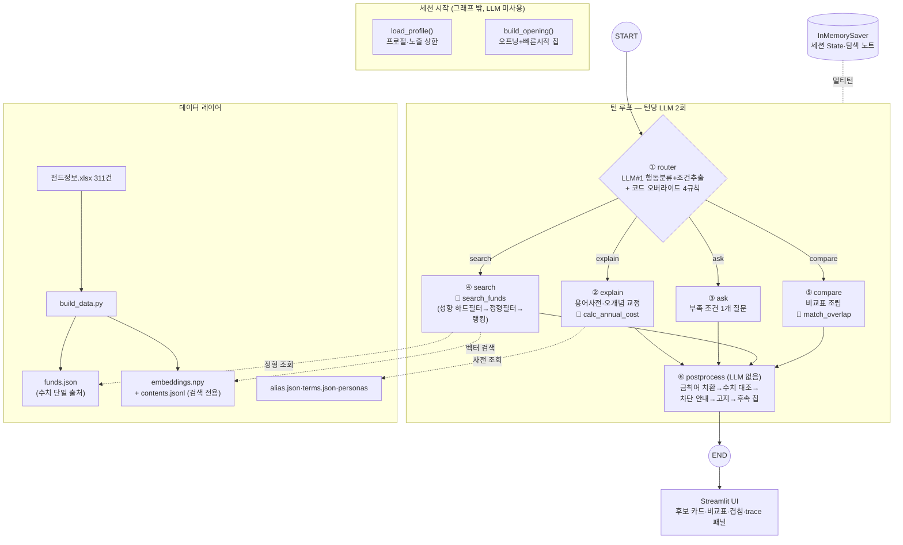

# 다이어그램 작성 요청 — "AI 펀드 길잡이" LangGraph 아키텍처

> 아래 명세를 바탕으로 **발표 슬라이드용 아키텍처 다이어그램**을 그려주세요.
> 도메인: 은행 펀드 탐색 AI 에이전트 (추천이 아니라 탐색 — 고객이 스스로 판단하도록 후보·근거·차이를 제시)

---

## 1. 시스템 개요 (그림에 담을 이야기)

- **ReAct 자율 루프가 아니라 명시적 분기 그래프**다. LLM이 도구를 자유 선택하지 않고, 라우터가 행동 4종 중 하나를 고르면 각 행동 노드가 정해진 도구를 **코드로** 호출한다.
- **턴당 LLM 호출은 정확히 2회**: ① 라우터(행동 분류+조건 추출, structured output) ② 응답 문장 생성. 나머지(검색 필터, 비용 계산, 겹침 매칭, 금칙어 치환, 안내 문구 삽입)는 전부 코드가 보장한다.
- 멀티턴: `InMemorySaver` 체크포인터 + thread_id로 세션별 State(탐색 노트) 유지.

## 2. 그래프 구조 (노드 6개)

```
[세션 시작, 그래프 밖]
  load_profile(persona_id) ──→ State 초기값 (프로필, 노출 상한)
  build_opening(profile)  ──→ 오프닝 인사 + 빠른 시작 칩 3개 (LLM 미사용)

[턴 루프 — 매 사용자 발화]
  START
    ↓
  ① router  ─ LLM #1: 행동 분류 + 조건 추출 (structured output)
    │         + 코드 오버라이드 4규칙 (아래 4장)
    ├─(조건부 엣지: action)─→ ② explain   용어 설명·오개념 교정
    ├─────────────────────→ ③ ask       부족한 조건 1개 질문
    ├─────────────────────→ ④ search    후보 검색 (도구: search_funds)
    └─────────────────────→ ⑤ compare   비교·겹침 (도구: match_overlap)
    ↓ (②~⑤ 각각 LLM #2로 응답 초안 생성 후)
  ⑥ postprocess ─ 출력 가드레일 (LLM 미사용, 전부 코드)
    ↓
  END → UI에 턴 결과(AgentTurnResult) + trace 전달
```

## 3. 각 노드의 역할과 도구

| 노드 | LLM | 코드가 하는 일 (도구) |
|---|---|---|
| **router** | ✔ #1 | 행동 4종 분류 + 조건 추출(종목·지역·테마·기간·손실감내·비용민감), 가드레일 플래그(판단위임·비범위) 감지, 오버라이드 규칙 적용 |
| **explain** | ✔ #2 | 용어 사전(terms.json 20항목) 최장일치 매칭 → 오개념 교정 / 비용 질문이면 `calc_annual_cost()` 계산 결과를 코드가 응답에 삽입 |
| **ask** | ✔ #2 | 미확보 슬롯 1개 선정(기간→손실감내→지역 순) → 질문 1개 + 답변 선택지 칩 |
| **search** | ✔ #2 | `search_funds()`: 성향 하드필터 → 정형 조건 필터 → 랭킹(비용 정렬 or 벡터 유사도) → 후보 카드 2~4개를 **funds.json 수치로 코드가 조립** |
| **compare** | ✔ #2 | 직전 후보에서 "1번·3번" 특정 → 정형 필드 비교표 조립 / 겹침 요청 시 `match_overlap()`: 보유종목 alias 매칭 (종목명만, 비중 미계산) |
| **postprocess** | ✘ | 금칙어 3범주 치환 → 수치 대조(근거 없는 % 문장 교체) → 성향 초과 차단 안내 삽입 → 고지 문구 삽입 → 후속 칩 3개(규칙 기반) → 최종 응답 확정 |

## 4. 라우터의 코드 오버라이드 4규칙 (그림에 작은 배지로)

1. 연속 질문 2턴 초과 → 강제 search 전환
2. 비교 대상 없는 compare → search 폴백
3. 겹침 요청 → 무조건 compare
4. 발화에 근거 없는 상품구조 힌트 → 제거 (LLM 오추출 차단)

## 5. 안전 레이어 (그림에서 강조할 부분)

- **입력 가드**: router가 "뭘 사면 돼요?"(판단 위임), "오를까요?"(비범위)를 플래그 → 응답에 재프레이밍 지시
- **노출 규칙 (하드 필터)**: 고객 투자성향 5단계 → 펀드 위험등급 노출 상한 (안정형2 / 안정추구3 / 중립4 / 적극5 / 공격6). 상한 초과 상품은 후보로 노출하지 않고, **차단 사실·사유·대안을 안내** (search_funds 내부에서 코드로 적용)
- **출력 가드 (postprocess)**: 금칙어 치환 · 수치 대조 · 차단 안내 · 고지 문구 — "LLM이 실수해도 코드가 막는다"

## 6. 데이터 레이어 (그림 하단에 배치)

```
펀드정보.xlsx (311개 상품, 원본)
   └─ build_data.py (빌드 1회)
        ├─ funds.json      ← 모든 수치의 단일 출처 (카드·비교표·계산)
        ├─ contents.jsonl  ← 고객언어형 검색 문서 (검색 전용, 응답에 미사용)
        ├─ embeddings.npy  ← text-embedding-3-small, InMemoryVectorStore
        ├─ alias.json      ← 종목 별칭 사전 (엔비디아=NVIDIA...)
        ├─ terms.json      ← 용어 설명 사전 20항목
        └─ personas/P1~P4  ← mock 고객 프로필
```

## 7. 참고용 Mermaid (레이아웃 참고, 그대로 렌더해도 됨)



## 8. 그리기 지시

- **스타일**: 발표 슬라이드용, 깔끔한 플랫 디자인, 한국어 라벨 유지
- **색 구분**: LLM 호출 노드(router + 행동 4종) = 한 색 / 코드 전용(postprocess, 도구, 데이터) = 다른 색 / 안전장치 = 경고색 포인트
- **강조 3가지**: ① "턴당 LLM 2회" ② 성향 하드필터(차단) ③ postprocess 가드레일 — 이 셋이 "자율성을 제한한 금융 에이전트" 논거임
- 도구(search_funds·calc_annual_cost·match_overlap)는 별도 노드가 아니라 **행동 노드 안의 부품**으로 표현 (🔧 아이콘 등)
- 좌→우 또는 상→하 흐름 중 슬라이드 비율(16:9)에 맞는 쪽으로
